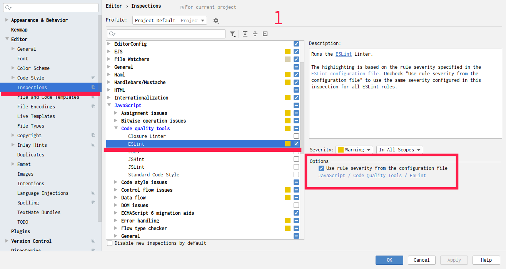
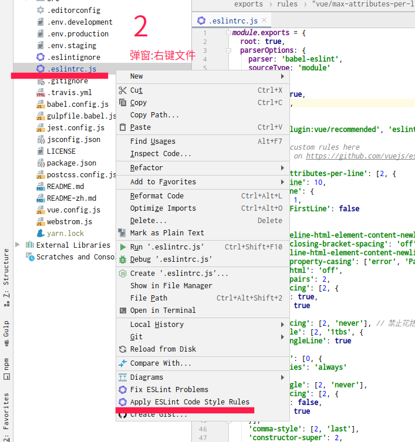
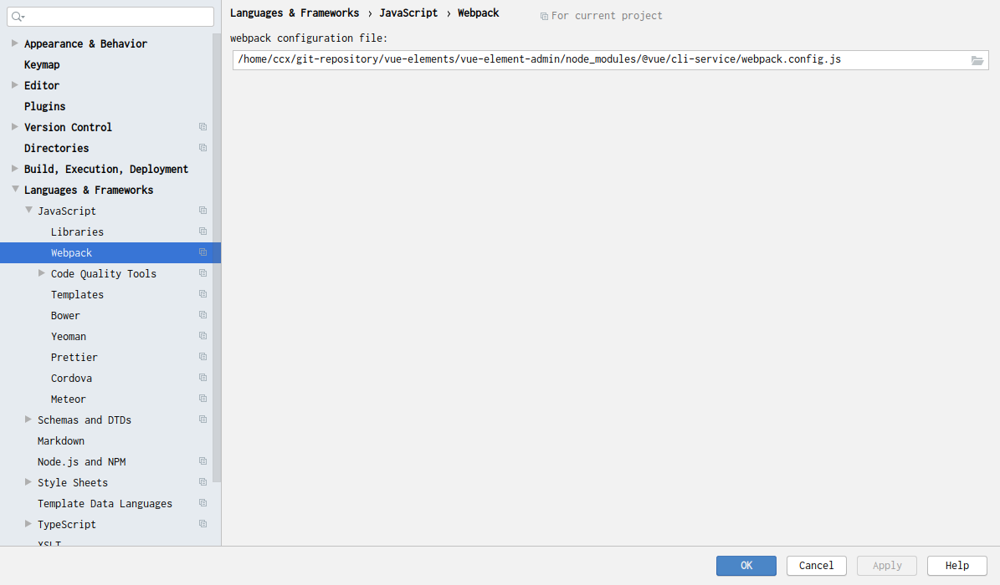

# vuejs

## Build Setup
```json
{"scripts": {
     "dev": "webpack-dev-server --inline --progress --config build/webpack.dev.conf.js",
     "start": "npm run dev",
     "unit": "jest --config test/unit/jest.conf.js --coverage",
     "e2e": "node test/e2e/runner.js",
     "test": "npm run unit && npm run e2e",
     "lint": "eslint --ext .js,.vue src test/unit test/e2e/specs",
     "build": "node build/build.js"
   }}
```

``` bash
# install dependencies
npm install

# serve with hot reload at localhost:8080
npm run dev

# build for production with minification
npm run build

# build for production and view the bundle analyzer report
npm run build --report

# run unit tests
npm run unit

# run all tests
npm test
```

For a detailed explanation on how things work, check out the [guide](http://vuejs-templates.github.io/webpack/) and [docs for vue-loader](http://vuejs.github.io/vue-loader).


# eslint 
使用 .eslintrc.js 规则覆盖 WebStorm 默认的代码格式化规则，避免格式化冲突  




# @ 路径前缀识别 
解决 WebStorm 无法识别 vue 组件带 @ 标记的路径前缀

